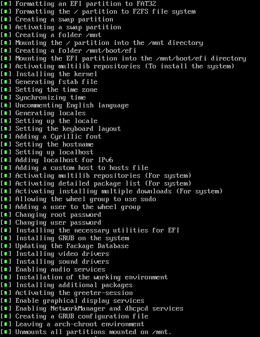

# ArchLinux-Installer

An Arch-Linux installer written in Python

## Installation

1. Clone the repository:
    ```bash
    git clone https://github.com/CelestifyX/ArchLinux-Installer.git
    ```

2. Navigate to the project directory:
    ```bash
    cd ArchLinux-Installer
    ```

3. Make `run` file executable:
    ```bash
    chmod +x ./run
    ```

4. Run the installer:
    ```bash
    ./run
    ```

## Usage

- Run `./run` to start the installation process.
- Follow the prompts to configure your Arch Linux installation.

## Screenshots


